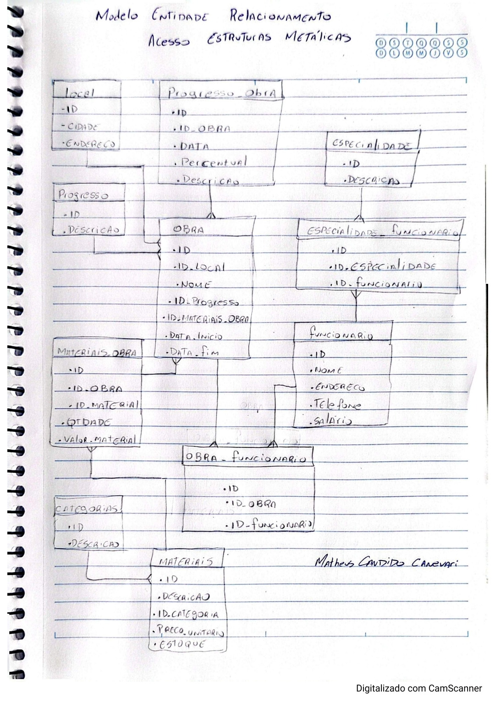

# Modelo Entidade Relacionamento (MER)

## Versão 1 - Junho/2026
Primeira versão do MER, elaborada manualmente algumas semanas antes de iniciar o desenvolvimento do projeto.

## Objetivo
Servir como guia para o desenvolvimento inicial do miniERP.

## Observações

- Pode sofrer alterações durante o desenvolvimento.
- Foi elaborado com base nos processos observados na área de estruturas metálicas.
- Algumas entidades poderão ser refinadas futuramente.